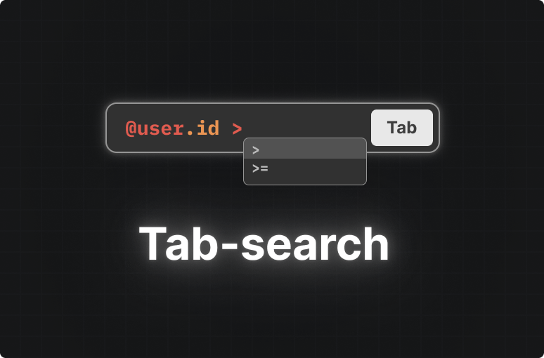

<div align='center'>

<h1>Tab-search</h1>

<p>Adapter for frontend and backend to create database search filter</p>



</div>

<br />

    ⚠️ This project is started by boon4681 just for fun.

## Usage

### Svelte, Hono, Drizzle ORM
```svelte
<!-- page.svelte -->
<script lang="ts">
    import "tab-search/codemirror";
    import "tab-search/codemirror/css";
    import { mode } from "mode-watcher";
</script>

<tab-search
    src="/api/v3/user/tab"
    theme={$mode} placeholder="Search something..."
    onchange={console.log}
/>
```

```typescript
// main.ts
import { serve } from '@hono/node-server'
import { Hono } from 'hono'
import { Tab } from "tab-search/drizzle"
// drizzle
import * as schema from "$schema"
import db from '$database'

const app = new Hono()
const tab = Tab(schema)

app.get('/tab', async (c) => {
    return c.json(crawler.use("USER").codemirrorSchema())
})

app.post('/tab',async (c)=> {
    const query = await c.req.text()
    const where = tab.use("USER").prepare(query)
    const data = await db.query.USER.findMany({
        where
    })
    return c.json(data)
})

serve({ fetch: app.fetch, port: 3000 }, (info) => {
    console.log(`http://localhost:${info.port}`)
})
```

## Documentation
The documentation is available on nothing.

## Author

- boon4681