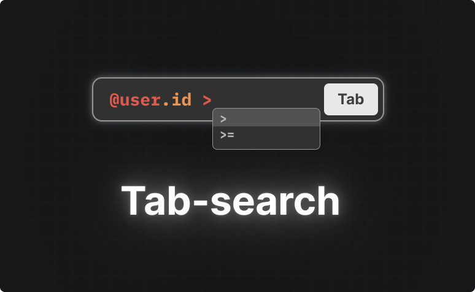
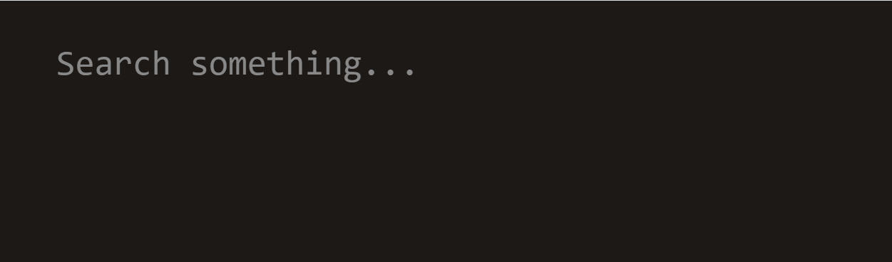

<div align='center'><h1>Tab-search</h1><p>Adapter for frontend and backend to create database search filter</p>



</div>

<br />

## Preview



## Usage

Install and register the web component:

```bash
npm install tab-search
```

```ts
import "tab-search/codemirror";
```

No CodeMirror CSS import is required. The editor renders in shadow DOM, so it can run beside another CodeMirror editor without sharing `.cm-*` styles.

Use a schema endpoint:

```html
<tab-search
    src="/api/tab-search"
    theme="light"
    placeholder="Search users..."
></tab-search>

<script type="module">
    const search = document.querySelector("tab-search");

    search.addEventListener("change", ({ detail }) => {
        console.log(detail.doc);
    });

    search.addEventListener("submit", ({ detail }) => {
        console.log("Submit:", detail.doc);
    });

    search.addEventListener("error", ({ detail }) => {
        console.error("Schema failed to load:", detail.error);
    });
</script>
```

Or set the schema directly:

```ts
import "tab-search/codemirror";
import type { TabSearchElement } from "tab-search/codemirror";

const search = document.querySelector("tab-search") as TabSearchElement;

search.schema = {
    tables: {
        user: {
            id: { type: "number" },
            email: { type: "string" },
        },
    },
};
search.value = "@user.id == 1";
```

Supported properties and attributes:

| Name | Description |
| --- | --- |
| `src` | URL returning the autocomplete schema. |
| `schema` | Schema object property or JSON string attribute. Takes priority over `src`. |
| `value` | Current editor value. Updates are reactive. |
| `placeholder` | Empty editor text. |
| `theme` | `light` or `dark`. |

Events:

| Event | Detail |
| --- | --- |
| `change` | `{ doc }` after a user edit. |
| `submit` | `{ doc }` when Enter is pressed and autocomplete did not consume it. |
| `ready` | `{ schema, src }` after a schema is installed. |
| `error` | `{ error, src }` when schema parsing or loading fails. |

Entering plain text, for example `สวัสดี`, performs a broad `LIKE` search across the selected table's text columns.

### Svelte, Hono, Drizzle ORM

```svelte
<!-- page.svelte -->
<script lang="ts">
    import { mode } from "mode-watcher";
    import { onMount } from "svelte";

    onMount(async () => {
        // Register only in the browser when using SSR.
        await import("tab-search/codemirror");
    });
</script>

<tab-search
    src="/api/v3/user/tab"
    theme={$mode} placeholder="Search something..."
    onchange={console.log}
/>
```

```typescript
// main.ts
import { serve } from '@hono/node-server'
import { Hono } from 'hono'
import { Tab } from "tab-search/drizzle"
// drizzle
import * as schema from "$schema"
import db from '$database'

const app = new Hono()
const tab = Tab(schema)


// create user tab
const tab$user = tab.use("USER", schema.USER)

app.get('/tab', async (c) => {
    return c.json(tab$user.codemirrorSchema())
})

app.post('/tab',async (c)=> {
    const query = await c.req.text()
    const [where, err] = await tab$user.prepare(query)
    if (err) {
        return c.json({ error: err.message }, 400)
    }
    const data = await db.query.USER.findMany({
        where
    })
    return c.json(data)
})

serve({ fetch: app.fetch, port: 3000 }, (info) => {
    console.log(`http://localhost:${info.port}`)
})
```

## Author

- boon4681
